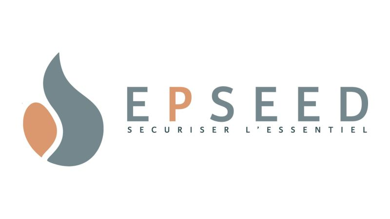
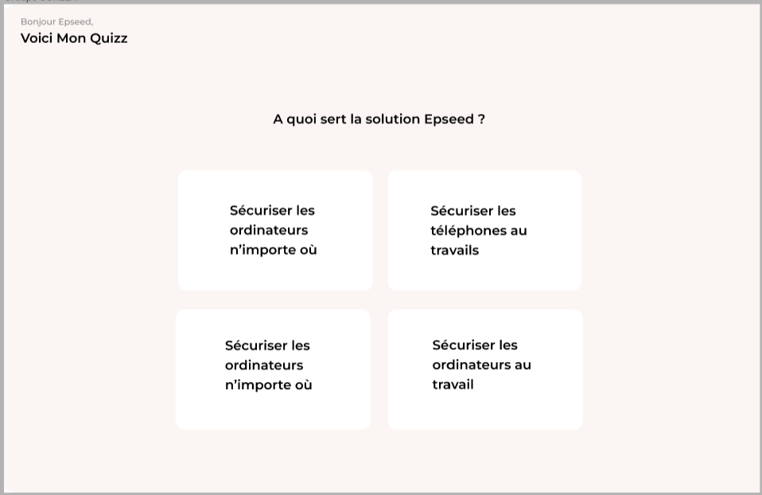

[10:37] juliette sivan
<a name="readme-top"></a>
 
<div align="center">
  
  <br/>
  <h3><b>🚀 Test Technique Epseed 2024 🚀</b></h3>
</div>
 
# 📖 Consigne
 
Création d'une page web de Quizz :
Vous allez créer une petite application de quiz qui pose des questions aux utilisateurs et affiche leur score à la fin.
 
<ol>
    <li><b>Ecran du quizz</b></li>
        <ul>
            <li>Afficher les questions en Card de maniere à ce qu'elles soient responsive.</li>
            <li>Permettre a l'utilisateur de séléctionner la carte.</li>
            <li>Ajouter un point de score pour valider la réponse et passer à la question suivante.</li>
        </ul>
    <li><b>Affichage du score</b></li>
        <ul>
            <li>A la fin du quizz, afficher le score de l'utilisateur sous forme de popUp</li>
        </ul>
    <li><b>Réinitialisation du <b>SUPER</b> quizz</b></li>
        <ul>
            <li>Ajouter un bouton sur la popUp qui réinitialise le quizz <b>ET</b> le recommence depuis le début avec un ordre aléatoire pour les quéstions.</li>
        </ul>
</ol>
 
## 🚀 Résultat
 
Ne vous focalisez pas sur cette maquette, l'important est que le quizz soit fonctionel :)
</br>
Bonne chance !!
 

 
### 💻 Accompagnement
 
Dans le fichier main.dart :
 
```sh
import 'dart:math';
import 'package:flutter/material.dart';
 
void main() {
  runApp(MyApp());
}
 
class MyApp extends StatelessWidget {
  @override
  Widget build(BuildContext context) {
    return MaterialApp(
      title: 'Epseed',
      theme: ThemeData(
        primarySwatch: Colors.blue,
      ),
      home: QuizScreen(),
    );
  }
}
 
class QuizScreen extends StatefulWidget {
  @override
  _QuizScreenState createState() => _QuizScreenState();
}
 
class _QuizScreenState extends State<QuizScreen> {
  final List<Question> questions = [
    Question(
      text: "A quoi sert la solution Epseed ?",
      answers: [
        "Sécuriser les ordinateurs n'importe où",
        "Sécuriser les téléphones au travails",
        "Sécuriser les ordinateurs au travail"
      ],
      correctIndex: 0,
    ),
    Question(
        text:"Qui n'est pas partenaire d'Epseed ?",
        answers: [
            "BPI France",
            "Horsinergia",
            "Nice Startup",
            "Cimgestion",
            "Microsoft"
        ],
        correctIndex: 4,
    ),
    Question(
        text:"Une seed c'est quoi ?",
        answers: [
            "Un triangle",
            "Un petit appareil conçu pour les entreprises, en particulier les petites et moyennes entreprises, où les employés utilisent leurs propres ordinateurs personnels pour travailler. Il permet aux utilisateurs d'accéder en toute sécurité à leur environnement de travail et à leurs fichiers depuis n'importe quel ordinateur en le branchant simplement via USB.",
            "Pas compris",
            "Epitech"
        ],
        correctIndex: 1,
    ),
    Question(
        text: "Tu veux un stage à Epseed ?",
        answers: [
            "Oui",
            "Non"
        ],
        correctIndex: 0,
    ),
    Question(
        text: "",
        answers: [
            ""
        ],
        correctIndex:
    )
  ];
 
  int currentQuestionIndex = 0;
  int score = 0;
 
  void selectAnswer(int selectedIndex) {
    if (selectedIndex == questions[currentQuestionIndex].correctIndex) {
      ...
    }
    setState(() {
      currentQuestionIndex++;
      if (currentQuestionIndex >= questions.length) {
        ...
      }
    });
  }
 
  void _showScorePopup() {
    showDialog(
      context: context,
      builder: (BuildContext context) {
        return AlertDialog(
          title: ...,
          content: ...,
          actions: ...
        );
      },
    );
  }
 
  void _resetQuiz() {
    setState(() {
      currentQuestionIndex = 0;
      score = 0;
      questions.shuffle(Random());
    });
  }
 
  @override
  Widget build(BuildContext context) {
    if (currentQuestionIndex >= questions.length) {
      return Scaffold(
        ...
      );
    } else {
      return Scaffold(
        ...
      );
    }
  }
}
 
class Question {
    final String text;
    final List<String> answers;
    final int correctIndex;
 
    Question({required this.text, required this.answers, required this.correctIndex});
}
 
 
```
 
 
## 👥 Author <a name="authors"></a>
 
<a href="https://www.linkedin.com/in/juliette-sivan/"> Juliette SIVAN</a>
 
 
## ❓ Des liens utiles au cas où
 
<a href="https://api.flutter.dev/flutter/material/Scaffold-class.html"> Scafold</a>
 
<a href="https://api.flutter.dev/flutter/widgets/State/setState.html"> SetState</a>
 
<a href="https://api.flutter.dev/flutter/material/AlertDialog-class.html"> AlertDialog (la popUp)</a>
 
<a href="https://api.flutter.dev/flutter/widgets/Column-class.html"> Column</a>
 
<a href="https://api.flutter.dev/flutter/widgets/Row-class.html"> Row</a>
 
<a href="https://api.flutter.dev/flutter/widgets/GestureDetector-class.html"> Gesture Detector</a>
 